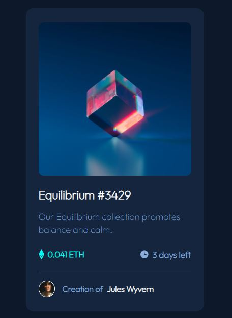

# Frontend Mentor - NFT preview card component solution

This is a solution to the [NFT preview card component challenge on Frontend Mentor](https://www.frontendmentor.io/challenges/nft-preview-card-component-SbdUL_w0U). Frontend Mentor challenges help you improve your coding skills by building realistic projects. 

## Author

  - [NFD César Ramírez](https://twitter.com/nfd_cesar)

    - Frontend Mentor: [César Ramírez](https://www.frontendmentor.io/profile/ramez-cesar)
    - Twitter: [César Ramírez](https://twitter.com/ramez_cesar)
    - [CodePen](https://codepen.io/ramez-cesar)

### Screenshot

### Links

- Solution URL: [Add solution URL here](https://github.com/ramez-cesar/nft-preview-card)
- Live Site URL: [Add live site URL here](https://ramez-cesar.github.io/nft-preview-card/)

## My process

### Built with

- Semantic HTML5 markup
- CSS custom properties
- Flexbox
- Mobile-first workflow